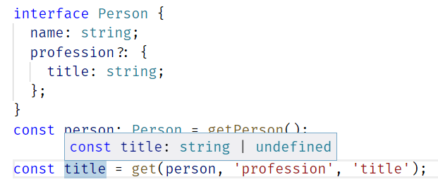

# get-optional

Typesafe utility functions for getting a property value that's deep in a structure
with possibly nullish intermediate values. 

Includes type definitions for **TypeScript** and **Flow** so that the validity of
arguments can be checked and return value inferred.



## Installation

```sh
npm i get-optional
```

## Basic usage

```javascript
import {get} from 'get-optional'
// Or:
var get = require('get-optional').get;

get({ greeting: 'Hello World' }, 'greeting'); // => 'Hello World'
```

## API

### `get(object, key1, key2, key3, key4, key5)`

Gets the value at a given path.  
Path must consist of 1-5 string keys.
If one of the keys in path (before the last key) points
to a null or undefined value, `undefined` is returned instead.

**Example**
```javascript
const object = { a: { b: null, c: { value: 42 } } };

get(object, 'a', 'c', 'value'); // => 42
get(object, 'a', 'b', 'value'); // => undefined
get(object, 'a', 'b');          // => null
```

### `getWithDefault(defaultValue, object, key1, key2, key3, key4, key5)`

Gets the value at a given path.  
Path must consist of 1-5 string keys.
If one of the keys in path (including the last one) points
to a null or undefined value, `defaultValue` is returned instead.

**Example**
```javascript
const object = { a: { b: null, c: { value: 42 } } };

getWithDefault('default', object, 'a', 'c', 'value'); // => 42
getWithDefault('default', object, 'a', 'b', 'value'); // => 'default'
getWithDefault('default', object, 'a', 'b');          // => 'default'

// The same expressed with the proposed optional chaining and nullish coalescing operators:
object?.a?.c?.value ?? 'default'; // => 42
object?.a?.b?.value ?? 'default'; // => 'default'
object?.a?.b ?? 'default';        // => 'default'
```

### `nth(list, index)`

Gets the element at a given index of an array.
If the index is out of bounds (larger than the length of the array),
`undefined` is returned instead.

**Example**
```javascript
const list = ['first', 'second', 'third'];

nth(list, 1); // => 'second'
nth(list, 3); // => undefined
```

### `nthWithDefault(defaultValue, list, index)`

Gets the element at a given index of an array.
If the index is out of bounds (larger than the length of the array)
or if the value to be returned is undefined or null,
`defaultValue` is returned instead.

**Example**
```javascript
const list = ['first', 'second', 'third'];

nthWithDefault('default', list, 1); // => 'second'
nthWithDefault('default', list, 3); // => 'default'
```

### `head(list)`
Gets the first element of an array.
If the array is empty, `undefined` is returned instead.

**Example**
```javascript
const list = ['first', 'second', 'third'];

head(list); // => 'first'
head([]); // => undefined
```

### `headWithDefault(defaultValue, list)`
Gets the first element of an array.
If the array is empty, `defaultValue` is returned instead.

**Example**
```javascript
const list = ['first', 'second', 'third'];

headWithDefault('default', list); // => 'first'
headWithDefault('default', []);   // => 'default'
```

### `method(obj, key1, key2, key3, key4, key5)`

Gets the method at a given path.    
Path must consist of 1-5 string keys.
The returned function will have `this` context bound to the second
to last value in the chain, i.e. to the object that contained
the function.

Always returns a function, so it's safe to chain calls `method(..)(..)`.  
If one of the keys in path points to a null or undefined value
or if the last value is not a function, a
no-operation function `noop` is returned instead. 

**Example**
```javascript
const container = {
  counter: {
    value: 1,
    add(amount) {
      this.value += amount;
    }
  }
};

method(container, 'counter', 'add')(2);
// container.counter.value === 3

// Doesn't do anything because therer's no "subtract" method.
method(container, 'counter', 'subtract')(2);
// container.counter.value === 3
```

## Caveats
* The type definition for Flow doesn't allow accessing class or interface
  properties with `get`/`getWithDefault`. Try to use types defined with `type` declarations
	instead, or cast the class instance to an indexable type before using
	(see _tests/typings/testbed/flow-should-pass/get.js_ for an example).
* No more than 5 keys are supported, unlike in most other similar implementations where
  any number of keys can be passed as the path. This is done to match the runtime behaviour
	with the static type definition and for better runtime performance.
* This library is **NOT** meant to be used for accessing *dynamic* property paths.
	```javascript
	// Don't do this
	get(input, ...propertyNamesList);
	```
  There are other libraries that handle that use-case better and safer, the focus of this one
	is in type safety and performance, not flexibility.

## Other tools like this
* [lodash.get](https://lodash.com/docs/#get) is a well-established and flexible utility function for safe property access.
	Lodash is also such a common dependency that you probably already have it, at least as a
	transitive dependency.  
	I recommend it if you aren't using TypeScript or Flow or you aren't so
	strict about your static types.
* [typesafe-get](https://github.com/pimterry/typesafe-get) seems very similar to *get-optional* for
  TypeScript users. I can't say much about it because I haven't personally used it (I started
	developing this one without knowing there was a typesafe alternative already). You might want
	to check that out anyway.
* [Optional chaining operator](https://github.com/tc39/proposal-optional-chaining) is *hopefully* coming
  to the language itself at some point and there's already a Babel plugin for it. The spec might still
	change, though, and some of the tools you are currently using might not support it.
